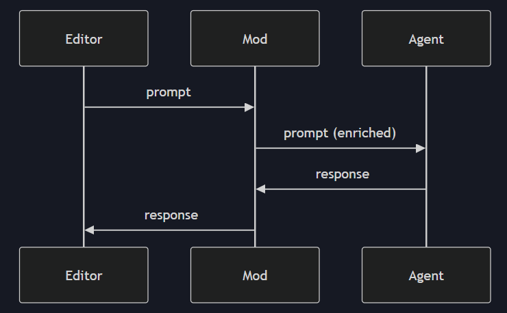
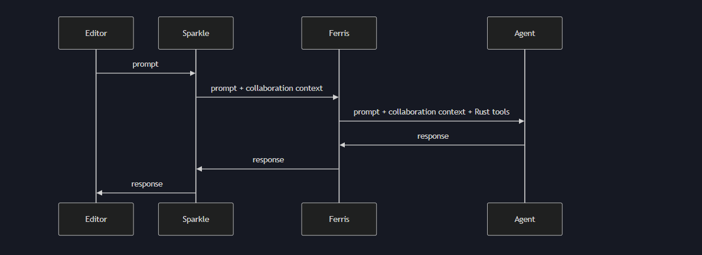

Exploring mods

. At the core, mods are middleware that sit between your code editor and your AI agent. They intercept and can modify the conversation flowing in both directions.
. ```mods are like middlewares that sits between your editor and the AI agent observing the conversation and enriching it. They help with enriching the prompt before it reaches the agent and the response before it reaches the editor```.



## what can mods do for me?
1. Inject context: A mod can add more information to the prompt before the agent sees it.
2. Provide tools: Gives an agent super powers.
    i. Ferris mod provides the tools of fetching rust crates and sources
    ii. Cargo mod provides cargo test and cargo build
3. Transform output: Modifies the output before it appears in the editor.
    - filter sensitive information
    - fomart code
4. Coordinate behaviours: Managing complex workflow
    - track state across multiple conversation turns.
    - coordinate between multiple agents
    - orchestrate multiple processes.

## note on mcp
-- An MCP server provides tools and resources that an agent can invoke (Symposium wraps it with an adapter that handles protocal translation).

## connections to things am already aware of.
1. MCP servers -> Symposium can wrap these as mods.
2. Agent skills such as (Claude's slash command) -> Can also be injected as mod

Mods are a superset of both. They can do everything those can do, plus also intercept and transform the conversation.

## Composability
Mods can be chained together each handling it's own responsibility.

1. sparkle mod adds collaboration context
2. ferris mod adds rust-specific tools
3. both enrichments reach the agent together.

Mods are interoperable - anyone can write one and they compose without coordination.
--
## Mods available in symposium.
1. Sparkle: The AI collaboration framework
    - sparkle appears to be a collaboration framework that learns your working patterns and help coordinate AI-Agent's behaviour.
- - Best for: Establishing patters for collaborations and meta-level coordination.

2. Ferris: Rust Crate Source Inspection
    - Provides tools for the agent to fetch and inspect Rust crate source code
- - Best for: When the agent needs to understand how to use a specific Rust crate's API correctly

3. Cargo - Compressed Cargo Command Output
    - Provides tools for running cargo commands and delivering the output to the agent in a compressed/optimized format
- - Best for: Letting the agent run builds and tests without getting overwhelmed by verbose output

## How to Enable Mods
- Configuration file - Probably a TOML or JSON file that specifies which mods to enable
- Mod chaining - Specifying the order in which mods should process messages
- Per-mod settings - Each mod may have its own configuration options
